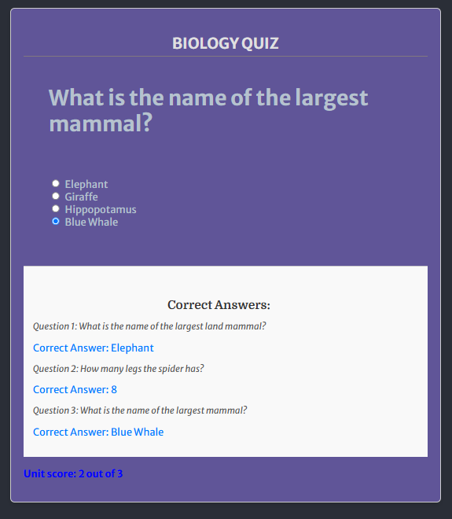

# Portfolio-project-2

JavaScript Essentials - based project

## Basic Knowledge Quiz Portal

The goal of the website is to test the user's understanding of basic facts related to our world. It has several user-friendly quizzes dedicated to different topics. Each quiz will assign a score for the knowledge in this particular area. After all quizzes are completed, the overall score is displayed, and the pass is granted if the minimum score is reached.

## Website Features

The website features four quizzes with topics targeting knowledge in biology, astronomy, geography, history, sports and pop culture. Each quiz-box will hold 3 to 5 questions on the relevant topic. Within each mini-session, there will be several sets of questions. After a set is complete, the achieved score will appear next to the maximum possible score in this set.

The JSON files, 6 in total with each file dedicated to corresponding topic are located in the assets/js folder. Each JSON file contains 10 to 15 questions. When presented on the Quiz page, these questions are shuffled as well as the order in which the answers show up. After each mini-quiz is completed, the correct answers are dysplayd so that the user can see whether he/she dame a mistake.

The final score that will pass has to be equal or exceed to the passScore which is currently set to be 70% of the total number of questions (maximum score)

### Main Page

The main page of the Quiz website contains the following sections:

- **Biology Quiz**: Questions related to biological concepts and facts.
- **Astronomy Quiz**: Questions related to astronomical phenomena and facts.
- **Geography Quiz**: Questions related to geographical locations and facts.
- **History Quiz**: Questions related to historical events and figures.
- **Sports Quiz**: Sport-related questions.
- **Pop Quiz**: Questions related to pop-culture.

### About Us Page

The About Us page provides information about the Quiz Portal, its mission, and its vision. It also includes details about the diverse quiz categories, interactive learning features, and the ability to challenge friends.

### Contact Page

The Contact page provides information on how to get in touch with the Quiz Portal team. It includes contact details such as email, phone number, office hours, and social media links.

## Technologies Used

- **HTML5**: For structuring the content of the web pages.
- **CSS3**: For styling the web pages.
- **JavaScript**: For adding interactivity and functionality to the quizzes.
- **Font Awesome**: For icons used in the navigation and other sections.
- **Google Fonts**: For custom fonts used in the project.

## How to Use

1. Clone the repository to your local machine.
2. Open the `index.html` file in your web browser.
3. Navigate through the quizzes and answer the questions.
4. View your score and see if you passed the quiz.

## Testing

### Lighthouse in Google Chrome

Lighthouse in Google Chrome resulted in overall 94%

### W3 validator

No errors or warnings found by W3 validator

### The W3C CSS Validation Service

### JavaScript validation with Jshint validator

No errors were encountered by Jshint validator
The following metrics were returned for the scripts.js file:

There are 12 functions in this file.
Function with the largest signature take 4 arguments, while the median is 1.
Largest function has 35 statements in it, while the median is 4.5.
The most complex function has a cyclomatic complexity value of 8 while the median is 1.

### Unfixed bugs

There seem to be no unfixed bugs at the moment

## Deployment

**The site was deployed to GitHub pages. The steps to deploy are as follows:**

Here is the link to GitHub Quiz repository: https://github.com/AlexeyKopchinskiy/Portfolio-project-2

- In the GitHub repository, navigate to the Settings tab
- Click the "Pages" link at the left side
- Select "Deploy from a branch" and "main" as the Branch. 
- Click save

The active link can be found here: https://alexeykopchinskiy.github.io/Portfolio-project-2/

**In order to peply the project on the local environment do as follows:**

- Navigate to the Code tab in the GitHub project repository
- Click on the green Code button and select "Open with GitHub Desktop"
- please note that in order for the above step to work a GitHub Desktop should be installed locally. 
- Follow this link to get the GitHub Desktop: https://desktop.github.com/download/
- From within the GitHub Desktop app click "Open in Visual Studio Code" if this is the editor of your choice

## Future Enhancements

- Add more quiz categories and questions.
- Implement user authentication and profile management.
- Add a leaderboard to display top scores.
- Enhance the user interface with more animations and effects.

## License

This project is licensed under the MIT License. See the [LICENSE](https://en.wikipedia.org/wiki/MIT_License) file for more details.

## Acknowledgements

- Thanks to [Code Institute](https://codeinstitute.net/) for providing the project guidelines.
- Special thanks to the contributors of Font Awesome, and Google Fonts for their amazing tools and resources.
- Thanks https://ui.dev/amiresponsive for generating snaphot of the website layouts.
