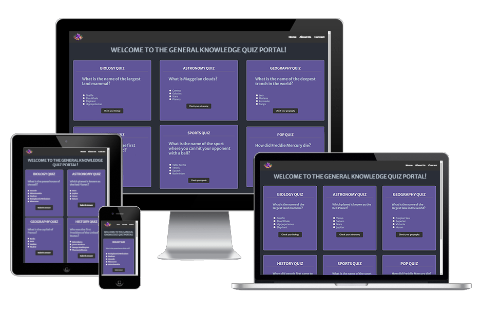

# Portfolio-project-2
JavaScript Essentials - based project

**Basic Knowledge Quiz Portal**

The goal of the website is to test the user's understanding of basic facts related to our world. It has several user-friendly quizzes dedicated to different topics. Each quiz will assign a score for the knowledge in this particular area. After all quizzes are completed, the overall score is displayed, and the pass is granted if the minimum score is reached.

## Website Features

The website features four quizzes with topics targeting knowledge in biology, astronomy, geography, and history. Each quiz-box will hold 3 to 5 questions on the relevant topic. Within each mini-session, there will be several sets of questions. After a set is complete, the achieved score will appear next to the minimum pass-score.

### Main Page

The main page of the Quiz website contains the following sections:
- **Biology Quiz**: Questions related to biological concepts and facts.
- **Astronomy Quiz**: Questions related to astronomical phenomena and facts.
- **Geography Quiz**: Questions related to geographical locations and facts.
- **History Quiz**: Questions related to historical events and figures.

### About Us Page

The About Us page provides information about the Quiz Portal, its mission, and its vision. It also includes details about the diverse quiz categories, interactive learning features, and the ability to challenge friends.

### Contact Page

The Contact page provides information on how to get in touch with the Quiz Portal team. It includes contact details such as email, phone number, office hours, and social media links.

## Technologies Used

- **HTML5**: For structuring the content of the web pages.
- **CSS3**: For styling the web pages.
- **JavaScript**: For adding interactivity and functionality to the quizzes.
- **Bootstrap 5**: For responsive design and layout.
- **Font Awesome**: For icons used in the navigation and other sections.
- **Google Fonts**: For custom fonts used in the project.

## How to Use

1. Clone the repository to your local machine.
2. Open the `index.html` file in your web browser.
3. Navigate through the quizzes and answer the questions.
4. View your score and see if you passed the quiz.

## Testing

### Lighthouse in Google Chrome

Lighthouse in Google Chrome resulted in overall 94%

### W3 validator

No errors or warnings found by W3 validator

### The W3C CSS Validation Service

## Future Enhancements

- Add more quiz categories and questions.
- Implement user authentication and profile management.
- Add a leaderboard to display top scores.
- Enhance the user interface with more animations and effects.

## License

This project is licensed under the MIT License. See the [LICENSE](https://en.wikipedia.org/wiki/MIT_License) file for more details.

## Acknowledgements

- Thanks to [Code Institute](https://codeinstitute.net/) for providing the project guidelines.
- Special thanks to the contributors of Bootstrap, Font Awesome, and Google Fonts for their amazing tools and resources.
- Thanks https://ui.dev/amiresponsive for generating snaphot of the website layouts.
